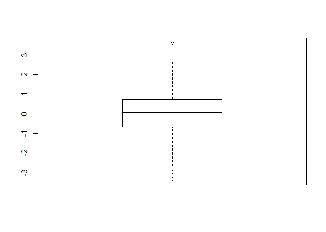

Data Visualization
================
Frank Loduca
2019-10-31

``` r
# Class 05 Data Visualization
x <- rnorm(1000)
mean(x)
```

    ## [1] 0.04422147

``` r
sd(x)
```

    ## [1] 1.015065

``` r
summary(x)
```

    ##     Min.  1st Qu.   Median     Mean  3rd Qu.     Max. 
    ## -3.33029 -0.67026  0.08290  0.04422  0.72923  3.58648

``` r
boxplot(x)
```

<!-- -->

``` r
hist(x)
```

<!-- -->

``` r
#rug(x)


weight <- read.table("bimm143_05_rstats/bimm143_05_rstats/weight_chart.txt")
```
