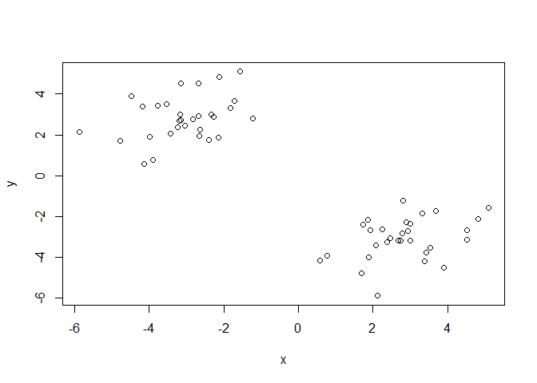
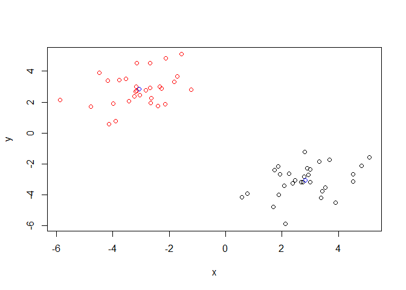
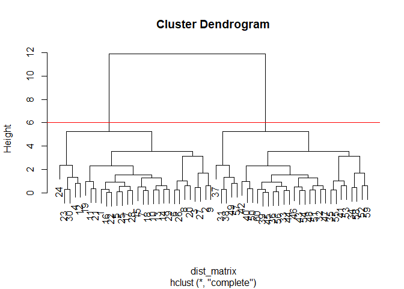
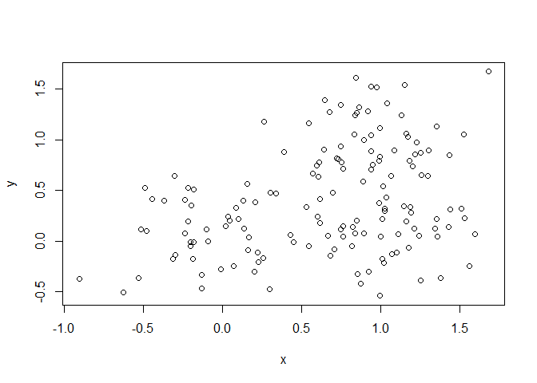
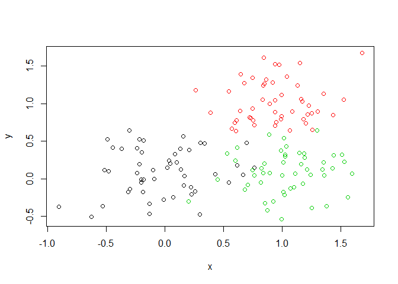
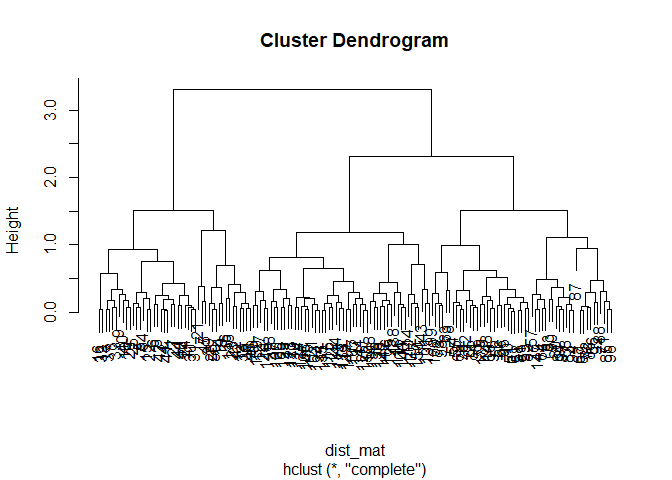

Pro08
================
Paul Loduca
10/24/2019

## Kmeans cluster

``` r
tmp <- c(rnorm(30,-3), rnorm(30, 3))
x <-  cbind(x=tmp, y=rev(tmp))
plot(x)
```

<!-- -->

``` r
k <- kmeans(x, centers = 2, nstart=2000)
```

``` r
plot(x, col = k$cluster)
points(k$centers, col= "blue")
```

<!-- --> \#\#Hclust –
input distance matrix from dist function

``` r
dist_matrix <- dist(x)
hc <- hclust(dist_matrix)
hc
```

    ## 
    ## Call:
    ## hclust(d = dist_matrix)
    ## 
    ## Cluster method   : complete 
    ## Distance         : euclidean 
    ## Number of objects: 60

``` r
plot(hc)
abline(h=6, col="red")
```

<!-- -->

``` r
grps <-  cutree(hc, h=6)
```

``` r
# Step 1. Generate some example data for clustering
x <- rbind(
 matrix(rnorm(100, mean=0, sd = 0.3), ncol = 2), # c1
 matrix(rnorm(100, mean = 1, sd = 0.3), ncol = 2), # c2
 matrix(c(rnorm(50, mean = 1, sd = 0.3), # c3
 rnorm(50, mean = 0, sd = 0.3)), ncol = 2))
colnames(x) <- c("x", "y")
# Step 2. Plot the data without clustering
plot(x)
```

<!-- -->

``` r
# Step 3. Generate colors for known clusters
# (just so we can compare to hclust results)
col <- as.factor( rep(c("c1","c2","c3"), each=50) )
plot(x, col=col)
```

<!-- -->

``` r
dist_mat <- dist(x)
clust <- hclust(dist_mat)
grps <- cutree(clust, k=3)
grps
```

    ##   [1] 1 1 1 1 1 1 1 1 1 1 1 1 1 1 1 1 2 2 1 2 1 1 1 1 1 1 1 1 1 1 1 1 1 1 2
    ##  [36] 1 1 1 1 1 1 1 1 1 1 1 2 1 2 1 3 3 3 3 3 3 3 3 3 3 3 3 3 3 3 3 3 3 3 3
    ##  [71] 3 3 3 3 3 3 3 3 3 3 3 3 3 3 3 3 3 3 3 3 3 3 3 3 3 3 3 3 3 3 2 2 2 2 2
    ## [106] 2 2 2 2 2 2 2 2 2 2 2 2 1 2 2 2 2 2 2 2 2 2 2 2 2 2 2 2 2 3 2 2 2 2 2
    ## [141] 2 2 2 2 2 2 2 3 3 2

``` r
plot(clust, col=grps)
```

<!-- -->

``` r
table(grps)
```

    ## grps
    ##  1  2  3 
    ## 45 52 53
