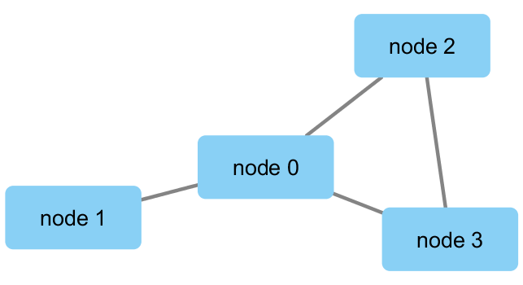

```{r setup, include=FALSE}
knitr::opts_chunk$set(echo = TRUE)
```

```{r}
library(RCy3)
library(igraph)
cytoscapePing()
cytoscapeVersionInfo()
g <- makeSimpleIgraph()
createNetworkFromIgraph(g, "MyGraph")
fig <- exportImage(filename="demo", type="png", height=350)

```
```{r}
setVisualStyle("Marquee")
fig <- exportImage(filename= "DemoMarquee", type ="png", height = 350)
knitr::include_graphics("./DemoMarquee.png")
```

```{r}
Styles <- getVisualStyleNames()
Styles
setVisualStyle(Styles[15])
setVisualStyle(Styles[2])
plot(g)
```
```{r}
prok_vir_cor <- read.delim("./data/virus_prok_cor_abundant.tsv", stringsAsFactors = FALSE)
head(prok_vir_cor)
```

```{r}
g <- graph.data.frame(prok_vir_cor, directed = FALSE)
class(g)
g
path(g)
```

```{r}
plot(g, vertex.label=NA, vertex.size = 3)
```

```{r}
V(g)
E(g)
```

```{r}
cb <- cluster_edge_betweenness(g)
cb
```

```{r}
plot(cb, y=g, vertex.label = NA, vertex.size = 3)
```

```{r}
head(membership(cb))
d <- degree(g)
hist(d, breaks=30,col="lightblue", main="Node Degree Distribution")
plot(degree_distribution(g), type = "h")
```

```{r}
pr <- page_rank(g)
head(pr$vector)
library(BBmisc)
v.size <- BBmisc::normalize(pr$vector, range=c(2,20), method="range")
plot(g, vertex.size=v.size, vertex.label=NA)
```
```{r}
v.size <- BBmisc::normalize(d, range=c(2,20), method="range")
plot(g, vertex.size=v.size, vertex.label=NA)
```
```{r}
b <- betweenness(g)
v.size <- BBmisc::normalize(b, range=c(2,20), method="range")
plot(g, vertex.size=v.size, vertex.label=NA)
```
